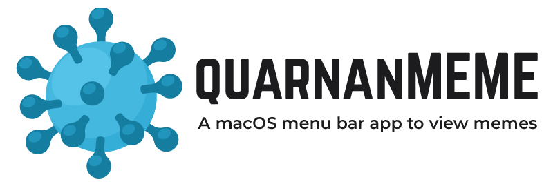

    

    
    

## Quaranmeme

#### What? Why?

Being stuck at home all day due to COVID-19 is no fun. Looking at memes is fun. I wanted to learn a bit about macOS development, so I made this app. It just shows you random memes right in your menu bar. Nothing more, nothing less.

#### Contributions

I have no immediate plans to update this app beyond any critical bugs that are found. If you'd like to contribute new features please [open a Pull Request](https://github.com/sabensm/quaranmeme/pull/new).
